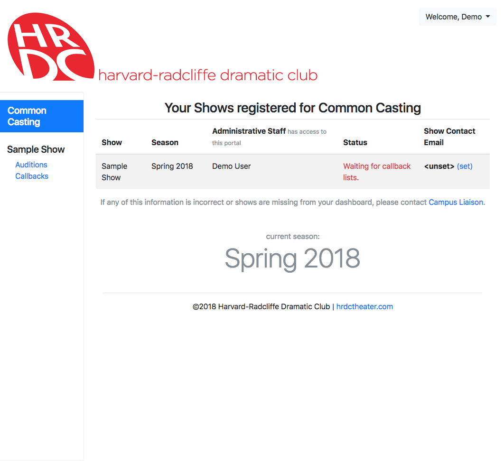
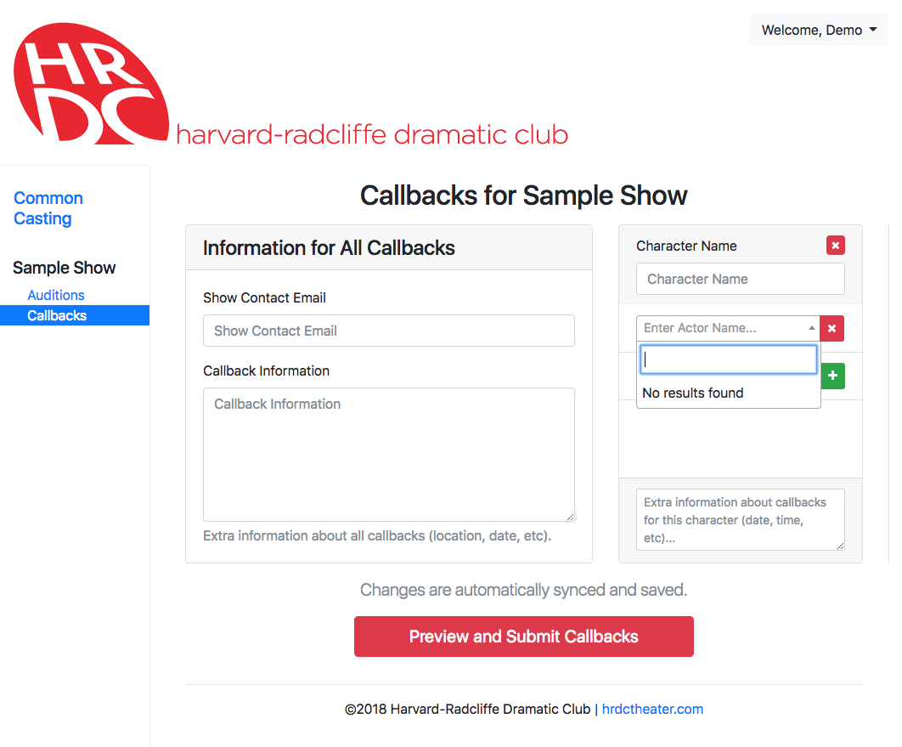

* TOC
{:toc}

# Welcome to HRDC Apps

To make common casting more efficient, the HRDC is now using a new online
system to faciliate audition tabling, as well as cast and callback list
publishing.

## Help and Support

If you run into problems or have a question about how to use this site, please
email [support@app.hrdctheater.com](mailto:support@app.hrdctheater.com).

If you encounter an error, please include when the error occurred, and as much
specific information about what happened as possible.

## Account Activation

If you are casting your show through common casting, you will be using this
system, located at [app.hrdctheater.com](https://app.hrdctheater.com/). In
order to create an account, you must be invited by a board member. As part of
your common casting registration, the campus liaison will invite you and you
will receive an email from "HRDC Apps" allowing you to activate your account.

**You must open this email and fill out your user profile to be able to manage
your show's auditions and casting!**

> Note: if you have been invited, but the invite link no longer works or you
> cannot find the email, you may go to
> ["Forgot password?"](https://app.hrdctheater.com/reset/) to set a password
> and activate your account.

Once you log in, you should see a list of shows you are a member of the
executive staff on (Producer, Director, or Stage Manager). If anything is
missing or incorrect, please contact the campus liaison.

# Common Casting Online

The [Common Casting Portal](https://app.hrdctheater.com/casting/staff/) will
be how you access auditioners' information, and also how you submit your
callback and cast lists. Lists will also be published to the site, and actors
will sign via it as well.

## Auditions

When actors sign in, instead of filling out a paper form, they will input all
of their contact information electronically, reducing time spent and paper
used, especially when actors audition for many shows.

In order to access this information, click the "Auditions" link under one of
your shows. As actors sign in, they will instantly appear in this table. You
can even easily copy their contact information into your own spreadsheet by
clicking the "copy" button, which will copy it to the clipboard in Excel-ready
format.

When you bring an actor into your audition room, make sure to hit the "call"
button to mark that you have them, and hit "done" when they leave so that
everyone else knows you are done with them.

### Audition Tabling

When auditions are currently happening, a list of building with auditions will
appear at the bottom of the dashboard. Clicking on a building will allow you
to see the list of actors who have signed in for that location, and also allow
you to open the actor sign-in form.

If you are tabling, you will present this form to actors for them to sign in.
If they have auditioned before, they can sign in quickly, otherwise they
will have to fill out their contact information.

## Callbacks

To submit your callback list, click the "Callbacks" link for a show. Any number
of staff members may edit the list simultaneously, as all changes will be
automatically and instantly synchronized.

Please provide all information about locations, dates, and times in the
appropriate text boxes, and remember, once you submit, **none of it can be
changed!**

To list more characters, scroll to the right and click the plus icon in the
corner. Then, click the plus icon below to list as many actors as you need. You
will be able to search by name and call back any actor who auditioned for your
show.

When callbacks are released, actors will be emailed automatically with the
callback information you input, and the lists will be visible publicly online.

## Cast Lists

Once callbacks have been released, you will be able to edit your cast list.
You will also submit your first-round casting choices using the same page.
The editor is very similar to that for callbacks, except now your casting
choices can be reordered. (Note that, once you submit your first-round casting,
you will not be able to move or change it.)

To cast ensemble roles, increase the number of actors that can sign for a
given role using the inputs at the bottom of the boxes. There is no limit to
this, so you may set it to the number of actors you cast for the part.
However, note that again, you cannot change this after submitting your
first-round cast.

> You may enter your entire cast list at any time, submitting your first-round
> cast list will only lock in your characters, first choices, and number of
> signers, nothing else.

### First-Round Cast Lists

When first-round cast lists are released, you will receive an email
notification from the website. You may then sign in and view first-round cast
lists for the rest of the season.

## Signing

When cast lists have been released, actors will receive emails notifying them
of their roles and allowing them to sign online. When they sign, that will show
up immediately on the online cast list.

*Warning: if you refresh too aggressively, you could get temporarily blocked
from the site. Be nice :)*

### Second-Round Signing

When the signing period ends, all first choice actors who have not signed will
automatically lose their roles to the next available alternate.

### Signing Issues

If an actor does not receive an email or is unable to sign for some reason,
they must contact the campus liaison for help or to sign for them.
