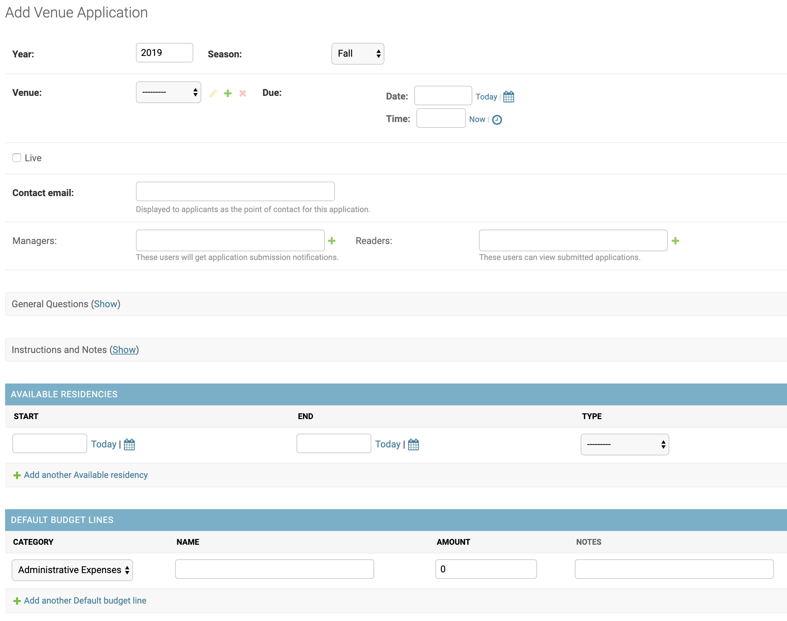
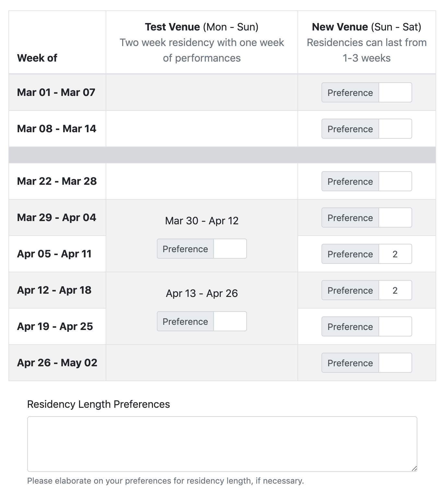
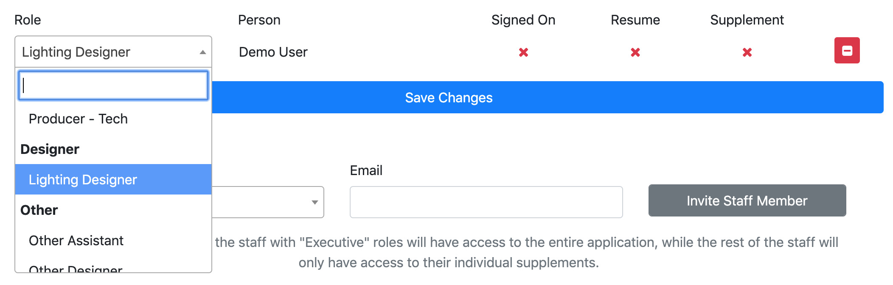
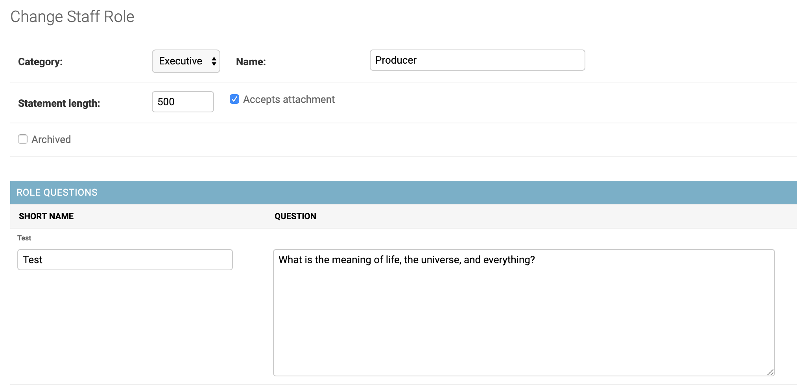
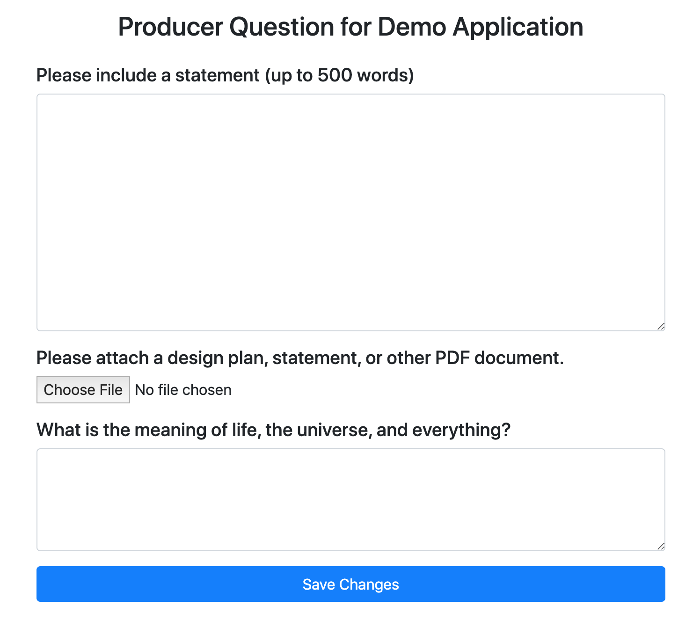
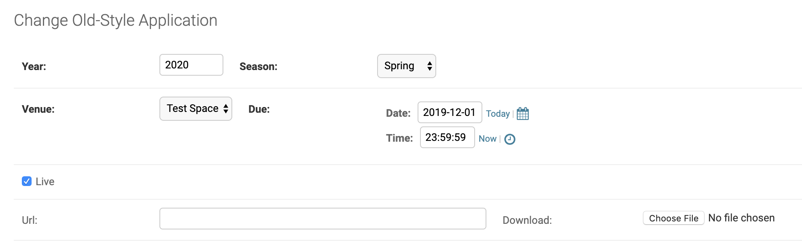
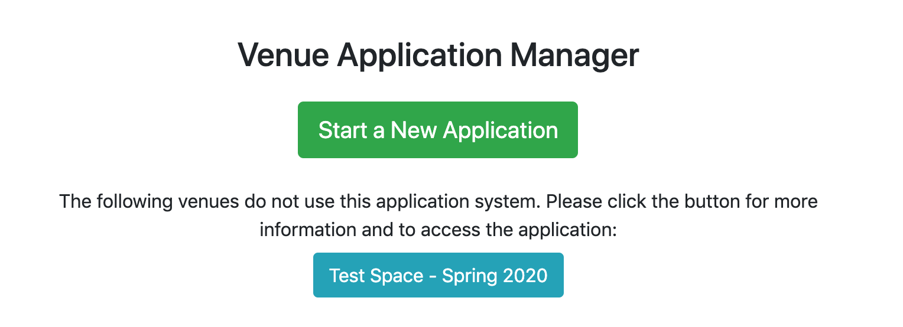

# Venue Application Administration
{:.no_toc}

* TOC
{:toc}

# Introduction

The venue application manager is designed to provide a flexible system for
production teams to apply for space. It provides an interface for collecting
staff lists, residency preferences, preliminary budgets, answers to arbitrary
additional questions, and supplemental statements, resumes, and PDF attachments
from each staff member if applicable.

It also allows uploading documents or linking to other websites to display
applications for venues not using this system, allowing all applications to
at least be listed in one place.

# Creating a Venue Application

New Venue Applications must be created for each application cycle, as the
majority of the information within them will vary from year to year.

The year, season, venue, and due date are hopefully self-explanatory (although
note that the time entry for the due date uses 24hr time, i.e. 23:59:59 for
11:59 PM). Venue applications will only be available to be applied to before the
due date AND while "Live" is checked.

The contact email is displayed to users at the bottom of every part of their
application while they are working on it, but is not used by the system for
any other purpose.

Managers will receive notifications when applications are submitted, and be
able to view the cover page, staff list, and residency preferences of
unsubmitted applications. Additionally, both managers and readers will be able
to view all submitted applications.

## General Questions

Admins may create and select general questions for the application on a
per-venue basis (if the same question is added to multiple venue apps, the team
will be asked to answer it once for each venue) that will be available to the
entire executive team as a part of the application.

For each application, you can select questions from the library of previous
questions, or add new ones. The "Short name" is purely for internal reference,
and is not visible publicly on applications.

Note that an application will only contain the questions that the venue
application had when it was created. In other words, if a production team starts
an application, and then you add or remove a question from the venue application
they are applying to, that addition or removal will not be reflected on their
application unless they start over.

## Instructions and Notes

These fields allow you to further customize your application, by providing
instructions that will be displayed at the top of the residency selection and
budget pages for this venue, respectively.

## Available Residencies

The system supports two types of availability ranges: single residencies and
available date ranges. The former is ideal for situations where you would
like to list inseparable ranges of dates that must be selected in blocks. The
latter is ideal when you have a range of dates within which variable-length
residencies can be assigned arbitrarily. The column on the left in the image
below is an example of the first type of available residencies, while the right
column is an example of the second.

Production teams also have the ability to elaborate on their residency
length preferences via a free-form text field, so they can clarify their
preferences if necessary.

## Default Budget

When a production team starts a new application, their budget will be populated
based on the defaults provided here. They will be able to add additional
budget lines that you do not specify, but will be unable to delete those you
provide (though they can rename them or set them to $0). Budget lines can fall
into one of four categories, Income, Administrative Expenses, Production
Expenses, or Other Expenses.

Note that an application will only be given the budget lines that the venue
application had when it was created. In other words, if a production team starts
an application, and then you add or remove a default budget line from the venue
application they are applying to, that addition or removal will not be
reflected on their application unless they start over.

# Viewing Unsubmitted Applications

To view unsubmitted applications, navigate to "Applications" in the site admin.
There you will see a list of every in progress (and submitted) application in
the system. By clicking on an application, you can then view the current cover
page information (title, cast and band sizes, etc), staff list, and residency
preferences.

# Available Staff Roles

On the staff list page presented to executive teams applying for space, they
have the ability to select the role for each staff member from a dropdown menu.
The options available in that menu are configured via the "Staff Roles" portion
of the admin interface. This configuration also affects the supplemental
questions presented to individual staff members.

## Configuring Available Staff Roles

Staff roles can be created and modified via the page in the site admin. They
are divided into seven categories, primarily for organizational purposes,
although "Executive" staff roles are unique in that staff members placed in
"Executive" roles will be given full access to the show in the app, including
the entire venue application, as well as common casting and other functionality,
should the show be granted space.

In order to remove a staff role from the dropdown, simply check the "Archived"
checkbox, rather than trying to delete the role. This will prevent the role
from being displayed or selected on staff lists.

### "Other" Staff Roles

"Other" staff roles are also special, in that they allow production teams to
assign custom roles to team members. Upon selecting an "Other" role in the staff
list, the user will be able to then input a custom name for the role, allowing
them to include staff members you did not think of.

However, if they manually type the name of an existing role, that staff member
will be coerced back into the role you have listed, and will be shown the
correct supplement for that role.

## Staff Supplements

Regardless of role, the system will ask for a resume and conflicts from all
staff members. The resume and conflicts they supply will also be shared across
all applications they are on for the entire season.

The system supports three kinds of supplements from individual staff members,
statements, attachments, and extra questions. If "Statement length" is non-zero,
the individual will be asked to provide a statement of "up to _" words, even
though the system will not actually enforce a word minimum or maximum. If
"Accepts attachment" is enabled, they will be asked to "Please attach a design
plan, statement, or other PDF document". Finally, one or more questions may be
listed for the role. The short name is entirely for internal administrative use,
and will not be shown to the user, only the question itself. The "required"
checkbox is currently ignored, and all questions are always required.

While the user will be able to save their supplement without providing an
attachment even if "accepts attachment" is checked for their role,
their supplement will not show as complete until they do provide one.

# Old-Style Applications

For venues that do not wish to use this system, their applications can still be
linked to or uploaded to the system as downloadable documents.

To do so, navigate to "Old-Style Applications" in the site admin. From there,
you can modify existing entries or add a new one.

Simply select the correct year, season, venue, and due date, and then either
provide the URL of the application or upload the application document. (You must
either provide a URL or downloadable application, but never both).

Like the normal venue applications, this application will only be publicly
visible before the due date, and only while "live" is checked.

