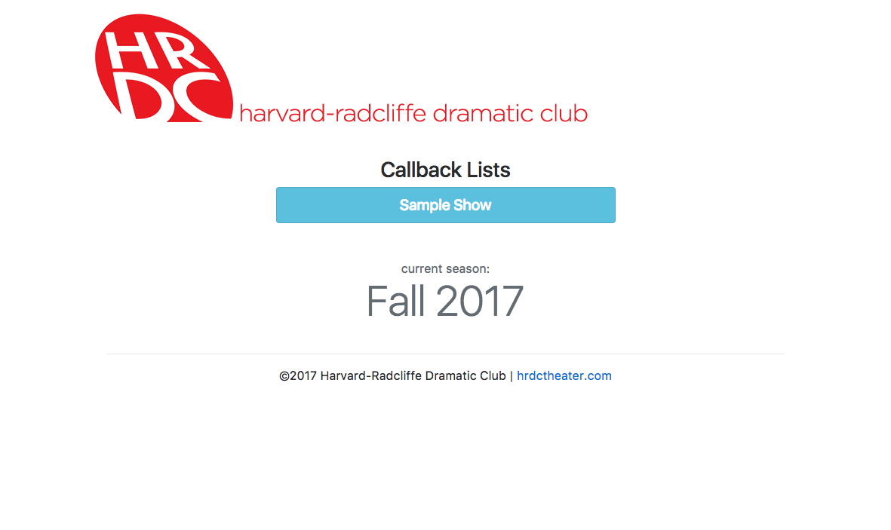
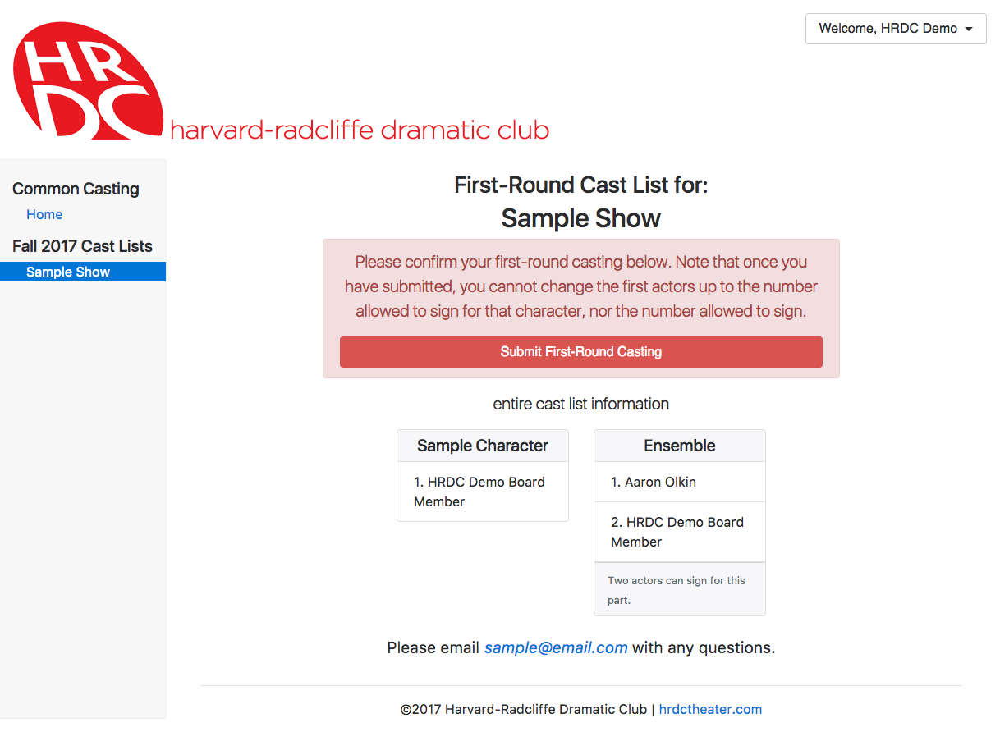

# Common Casting Online
{:.no_toc}

* TOC
{:toc}

# Introduction

This document intends to serve as both an instruction manual for the web
application, as well as a description of the functionality and service it
provides. The numerous screenshots included should both help in understanding
how to use it, as well as quickly show everything it does.

## General Concepts

### Permissions

There are a few different permission levels that will be referenced throughout
this document:

The lowest is that of an unauthenticated user, who can only browse released
callbacks and cast lists.

Next, actors can sign for their shows via a link they receive via email,
or if they create a password they can log in and edit their profile.

"PDSM"s are anyone who is a staff member of any show. They can use the
common casting site for their shows, and also view first-round cast lists.

Regardless of their status as a PDSM, a user can also be a "board member",
part of a group of users, which the "superuser" can add other users to.
Board members can use most of the admin site to set up and edit shows, casting
release information, and view the status of the above.

The highest, "superuser", would belong to the President, and possibly one or
two other board members. They can do almost anything, including sign onto shows
for actors and edit user profiles directly.

### Current Season

The current season, relevant throughout the system, must be manually set and
changed by the site superuser.

# Setting Things Up

## Setting up a show

To set up a show for common casting, go to the site admin and select
"Casting-Enabled Shows". From there, you may click on an existing show to edit
it, or click "Add Casting-Enabled Show" to create a new one.

A casting-enabled show is simply a show that is linked to a casting-release
group, as well as a number of audition slots. As such, the new/edit screen
provides a way to select an existing show and existing casting release group,
or create new ones via the small green plus buttons.

### Show

Upon clicking the plus button to create a new show, a window will pop out
allowing entry of the show's title, season, and space.

> Note on spaces:
>
> Shows, auditions, etc must all take place in spaces.
>
> New spaces can also be created trivially, at which time they must also be
> assigned to a new or existing building. At this time, the address data of a
> building is unused. Disable "include building name" if the name of the space
> should stand alone.

Additionally, one or more staff members must be chosen for the show.
If necessary, new ones can be invited by email. Their names will will not show
up in the system until they have logged in for the first time and created
their profile.

The "slug" field typically does not need to be adjusted manually, unless a
show is being set up with the same name as a previous show. (Slugs must be
unique across the entire system).

### Casting Release Group

In addition to the Show, a Casting Release Group object must be chosen.

To create a new one, just click the green plus button again. These can be saved
immediately, without adding any information, although the information will
need to be added later then. For more information, see "Setting up a casting
release group".

When selecting an existing group, note that if that group is only attached to
one show already, it will be listed as that show. If it is attached to multiple
shows, it will be listed based on the season of those shows.

### Slots

Casting-enabled shows should have a number of audition slots. An audition slot
is fairly self-explanatory. The categorization of spaces within buildings is
important, because when the system generates the list of shows to sign into
in the sign-in form, it is by building.

Note: 12:00 AM is basically 00:00 AM, so a slot from 9:00 PM to 12:00 AM
will be nonexisting. Instead, use 11:59 PM.

## Setting up a casting release group

A casting release group keeps track of the stage of the casting process, and
controls the automatic release and distribution of callback and cast lists.

NOTE: Heed the warnings on the editing page. You must double-check yourself.

Once dates and times are set, the group's stage will automatically advance at
the given time, allowing actors or PDSMs to view additional pages and sending
email notifications as appropriate.

WARNING: "second signing opens" will mark all first-cast actors who have not
responded as having rejected those roles at the given time.

# Casting - PDSM Interface

Upon navigating to the common casting home page, PDSMs are presented with a
list of shows they are working on. They can work on individual aspects of
casting a given show by clicking the links in the sidebar.

Additionally, for PDSMs or Board Members, if audition slots are currently
happening, a list of buildings will be displayed.

## Tabling and Actor Sign In

Upon navigating to the tabling page for a given building, the "Actor Sign-In
Form" may be opened. It can be presented to actors directly, for them to sign
in, or not.

> Actor Sign-In
>
> The sign-in form first asks actors for their email, as well as which shows
> they are interested in auditioning for. If they have signed in before, the
> system recognizes their email address and immediately signs them in. If not,
> they are asked to enter their name, phone number, and PGPs, after which they
> will be signed in.

As actors sign in, they will instantly appear in the tabling list.

## Holding Auditions

In the audition room, PDSMs can view the "Auditions" page for their show, which
lists every actor that has signed in to audition for their show. Just like the
tabling page, actors will instantly appear on the auditions page when they
sign in.

The auditions page provides two useful features:

The "copy" button instantly copies the actor's name, email, phone number, and
PGPs to the clipboard, ready to be pasted into a Google Docs or Excel
spreadsheet.

The "call" button, when clicked, updates the audition status to "called". This
update will show up instantly for anyone tabling in that building, as well as
any other PDSMs viewing the show's auditions page. After "call"-ing an actor,
the button will change to "done", allowing a PDSM to mark the actor as having
auditioned (an update that again, will be instantly reflected everywhere).

### PDSM Mistakes - Audition Admin

Occasionally, PDSMs will forget to mark an audition as done. This can cause some
problems, and therefore, any auditions still in progress after their slot ends
will automatically be marked as done. If this doesn't happen, casting
administrators can use the Audition admin to mark auditions as done via the
multi-select action dropdown.

Additionally, if a show wishes to callback or cast an actor who did not show up
to auditions, there are two ways to enter them into the system. One is to create
a fake slot for the current time and sign them in via the normal process.
Alternatively, the Audition admin can be used to create a fake Audition for
them. When doing so, select the right show and actor, select any space,
and make sure to check "Sign in complete". This will cause the given actor to
show up in the show's list.

## Callbacks

After holding auditions, PDSMs must enter callback information.

The system allows PDSMs to enter text that will be displayed above the entire
callback list, a contact email, and a separate piece of text to be displayed
with each character listing. This allows PDSMs to provide information about
callback location and timing.

For each "Character" they add, PDSMs can then use the dropdown to search for
actors who signed-in to audition for their show to call back. While the system
will let PDSMs select actors who did not audition for their show if they type
enough of the name, it will not accept actors who are not in the system.

All information inputted on this page is instantly and automatically saved,
and will also be synced to anyone else who is editing at the same time (much
like Google Docs).

### Callback Submission

When they have entered all of their callbacks, PDSMs must press the submit
button to preview their callback list. The preview page displays the callback
list exactly as it will appear to actors. From there, PDSMs can submit their
callback list, after which they will no longer be able to edit it.

In the admin interface, board members can then see which shows have and have
not submitted their callback lists.

### Callback Release

When the previously-set time passes, all submitted callback lists will be
published (in fact, if a callback list has not been submitted yet, the
publishing will wait for it).

Callback release will first automatically email every actor who was called
back with a list of all of their callbacks, then it will update the casting
release group's stage. When this is done, callback lists will be visible to
anyone, without logging in.

## Cast Lists

Once callback lists have been released, PDSMs can create their cast lists.
The interface for doing so is very similar to the callback list interface,
except that the ordering of the list of actors matters, and as such the
interface includes buttons to re-arrange the ordering.

However, instead of allowing additional information to be listed with each
character, PDSMs can change the number of actors allowed to sign. This is
designed for casting ensemble roles; if it is increased, the first n actors
will be allowed to sign.

NOTE: While additional characters can be added, characters for which callbacks
were listed cannot be removed or edited, and must have actors cast as them.

### Allowing Multiple Signatures

If a show would like to allow a role to be signed for in addition to other roles
in that same show, they should create the role as normal. Then, before cast
lists are released, an administrator can use the Character admin page to check
"Allow multiple signatures" for that character. Actors will then be able to
sign for the given role in addition to other roles in that show.

### First-Round Cast Lists

The submission and release procedure for cast lists functions very similarly to
callbacks, except that there are two stages. The first time through the
submission procedure, only the first-choice actors will be listed.

Once first-round casting has been submitted, of course, it cannot be changed,
and will be locked on the cast list editing page. Additionally, new characters
cannot be added, nor can the number of allowable signers be changed after
first-round casting is submitted.

Though it is not recommended, PDSMs can submit their final cast list as soon as
they submit their first-round cast list.

### First-Round Cast List Release

Very similarly to callback release, after the given time passes, PDSMs will be
emailed a notification that first-round cast lists have been released, allowing
them to browse all first-round cast lists for the season. Additionally,
links will appear on the Common Casting home page for PDSMs. Unlike callbacks,
the first-round cast lists are not viewable publicly.

### Final Cast Lists

After submitting their first-round cast lists, PDSMs can edit their alternates
before submitting their final cast list, in a process very similar to the
above. Once cast lists are released, they replace callbacks on the public site.

## Callback and Cast List Mistakes

While the admin interface does not provide a way to directly fix mistakes in
callback or cast lists, it does allow undoing the team's submission of said
list, allowing the team to go back in and fix the mistake themselves. To do so,
simply go to the show in the Common Casting admin and unchecked the appropriate
box under "Submitted Lists". The team will then be able to continue editing
and submit again when they have fixed their mistake.

# Actors' Interface

## Casting

When cast lists are released, all actors who have been cast will be emailed
notifications listing all roles they have been cast as.

Once published, the cast lists also display icons indicating whether actors
have signed for their roles. (Note: these do not update live, the page must be
refreshed.)

## Signing

Until the signing period opens, the signing page is disabled, telling actors
when it will open. When the signing period begins, all actors are emailed
again reminding them the signing period is now open, and the signing page is
enabled.

To sign, actors must click the link emailed to him. Unless they have set a
password, that is the only way for them to identify themselves to the system
and ensure the signing process is secure. After clicking that link, actors
simply select whether they are accepting or rejecting each role offered to
them. They can submit with only some choices made, and come back to others
later, but cannot change decisions once submitted.

> Note: if an actor has trouble signing, the superuser can edit and set
> signing responses in the admin interface. This overrides everything else,
> so be careful.

If a role is no longer available to an actor, because an earlier choice has
accepted it, that will be visible when they go to sign and they will no longer
be able to sign for that role.

On the other hand, when an actor rejects a role for which they are the current
first-choice, the next actor in line receives a notification email reminding
them that it is now available for them to claim.

As actors sign on to shows, the icons on the cast list will update to reflect
their signing.

### Temporarily Disabling Signing

To temporarily disable signing, check the "Disable signing" checkbox for the
Casting Release Group. This will prevent actors from submitting their
acceptances or rejections of roles they have been cast in until unchecked again.

### Second-Round Signing

When the second signing time passes, all first-choice roles which have not been
accepted are automatically marked as having been rejected, notifying the next
in line and allowing them to sign.
